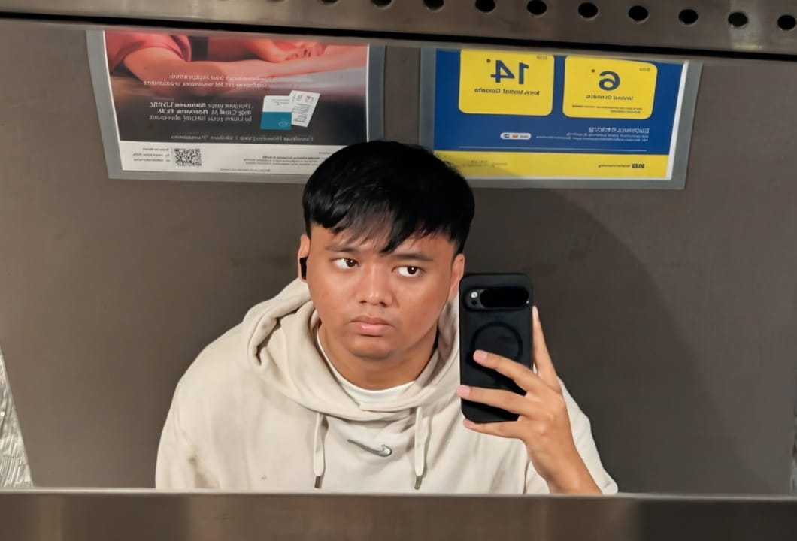
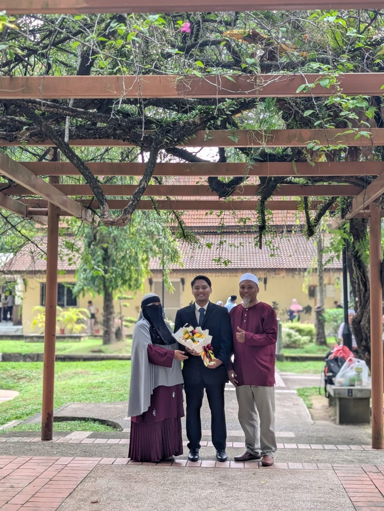
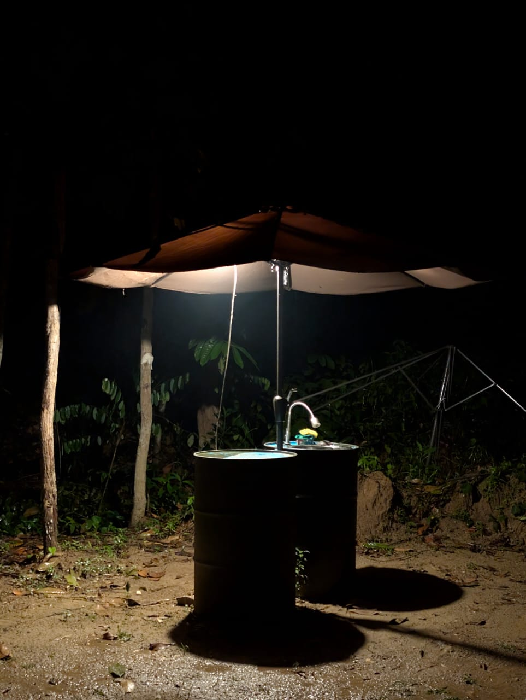
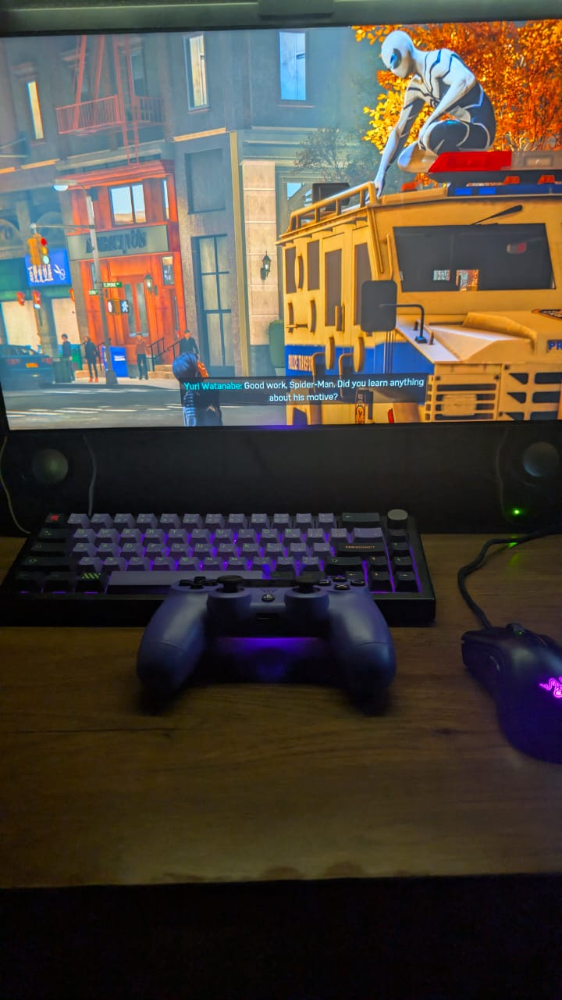
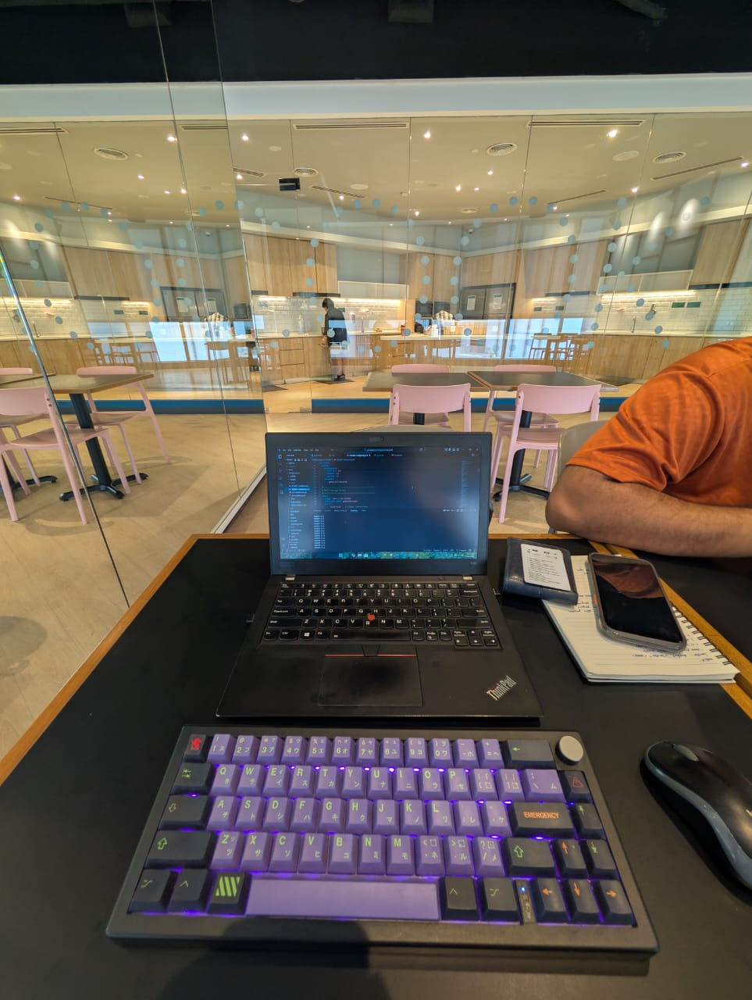

# hi, i'm muhaimin 👋

mobile app developer from malaysia.
i like apps that solve *one annoying thing* properly.

---

### about

i build mobile apps — mostly flutter, slowly picking up more on the full-stack side (next.js, go) and helping out with general it stuff when it comes up. i'm not trying to sound bigger than the work. i just like building useful things and learning the stack properly.

most of what i make starts from a small personal friction — splitting bills with friends, tracking zikir counts, dumb discord bots — and grows only when it needs to.

---

### what i'm working with

`flutter` · `dart` · `riverpod` · `go` · `next.js` · `react` · `typescript` · `tailwind` · `supabase` · `firebase` · `postgres` · `figma`

---

### a few projects

- **[selawathub](https://github.com/MuhaiminRoshaizad/SelawatHub)** — selawat & zikir companion, with daily content and progress sharing. flutter + supabase.
- **[payback](https://github.com/MuhaiminRoshaizad/PayBack)** — split-bills and repayment tracker for friends/roommates. flutter.
- **[discord-facts-bot](https://github.com/MuhaiminRoshaizad/discord-facts-bot)** — multi-server bot that posts a fact of the day. python.

more on my [portfolio](https://minned.pages.dev) ↗

---

### education

<table>
  <tr>
    <td width="60%" valign="middle">
      <ul>
        <li><b>b.comp.sci. (hons.) mobile computing</b> uitm kuala terengganu &nbsp;·&nbsp; <i>2021–2025</i></li>
         
        <li><b>engineering foundation</b> uitm dengkil &nbsp;·&nbsp; <i>2020–2021</i></li>
         
        <li><b>spm, electrical & electronic engineering</b> smt tar putra &nbsp;·&nbsp; <i>2018–2019</i></li>
      </ul>
    </td>
    <td width="40%" align="center">
      
    </td>
  </tr>
</table>

---

### off-screen

when i'm not at the laptop i'm usually outside, gaming, or quietly working from a café somewhere.

<table>
  <tr>
    <td width="33%" align="center"></td>
    <td width="33%" align="center"></td>
    <td width="33%" align="center"></td>
  </tr>
  <tr align="center">
    <td>outside</td>
    <td>unwinding</td>
    <td>the daily desk</td>
  </tr>
</table>

---

### find me

[portfolio](https://minned.pages.dev) · [email](mailto:aminmuhaimin192@gmail.com) · [linkedin](https://www.linkedin.com/in/muhammad-muhaimin-bin-roshaizad/) · [instagram](https://www.instagram.com/minnedddd/)

